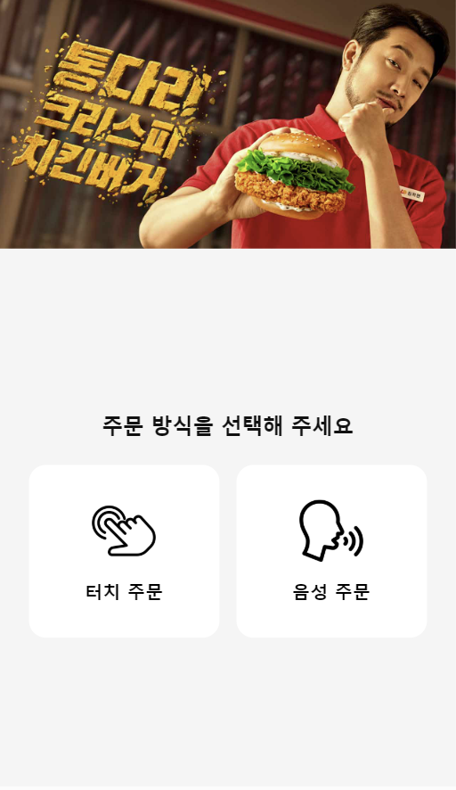
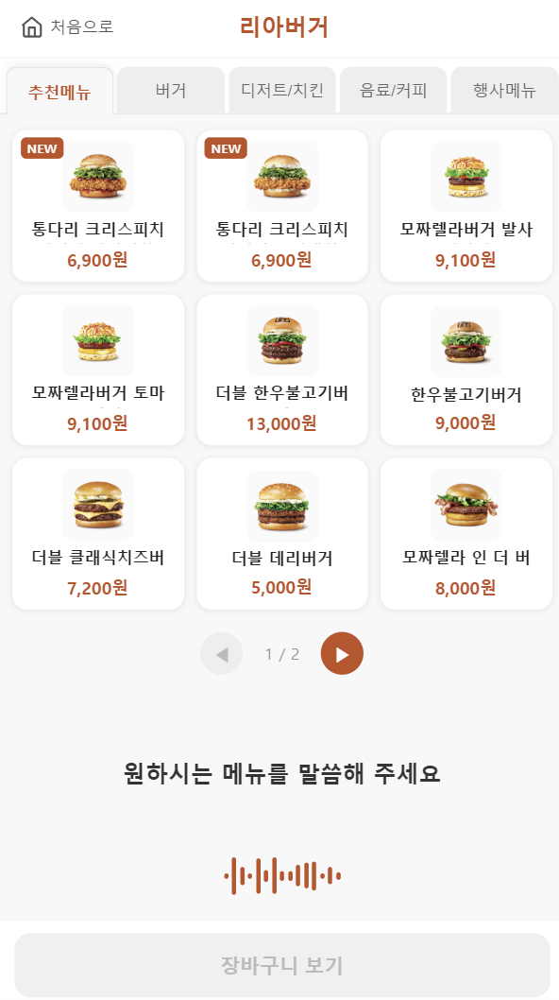
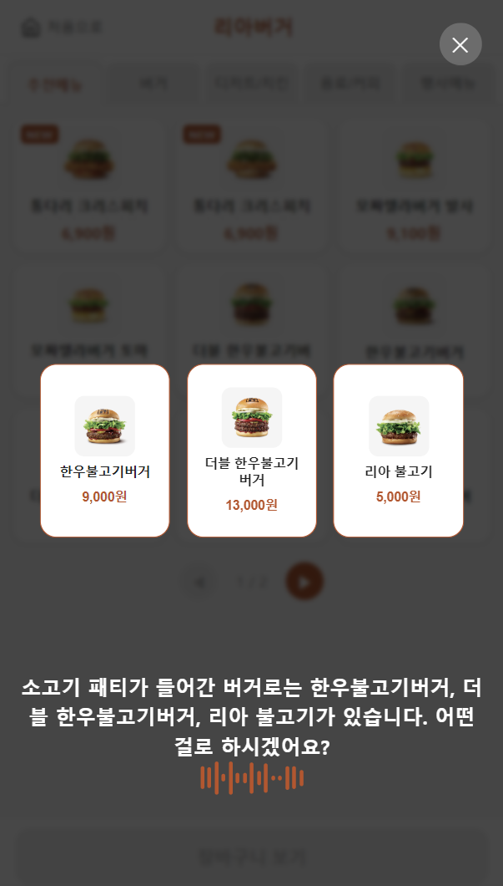
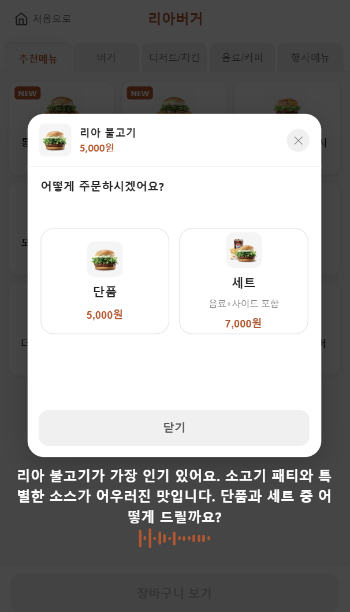
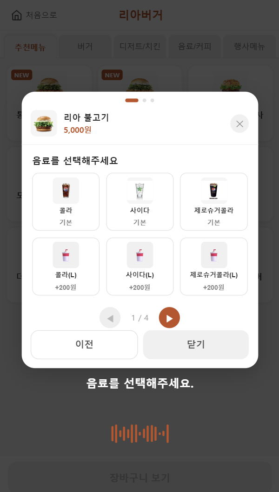
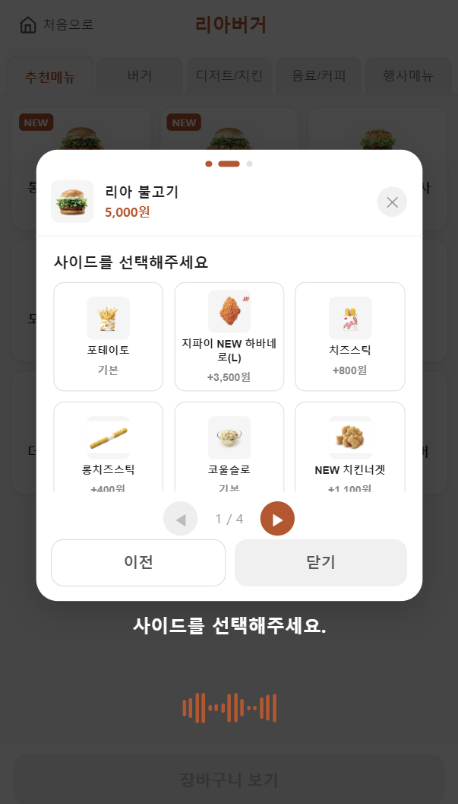
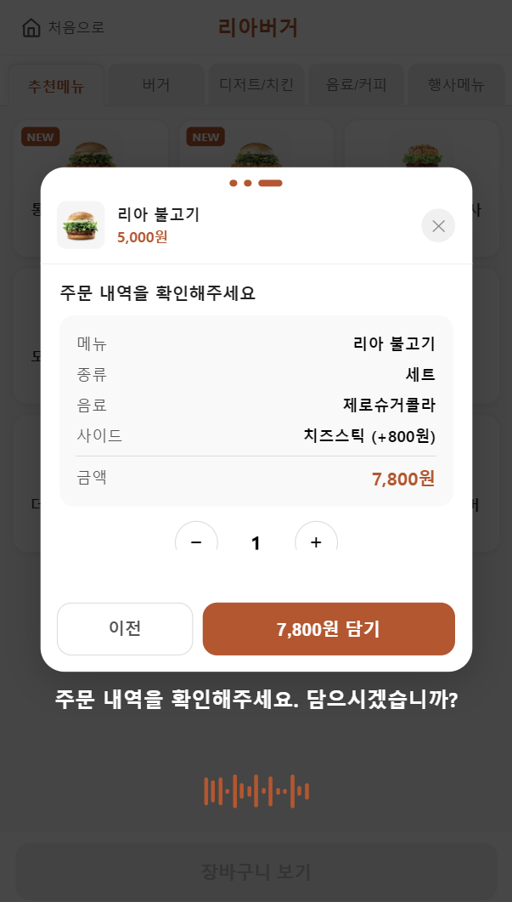
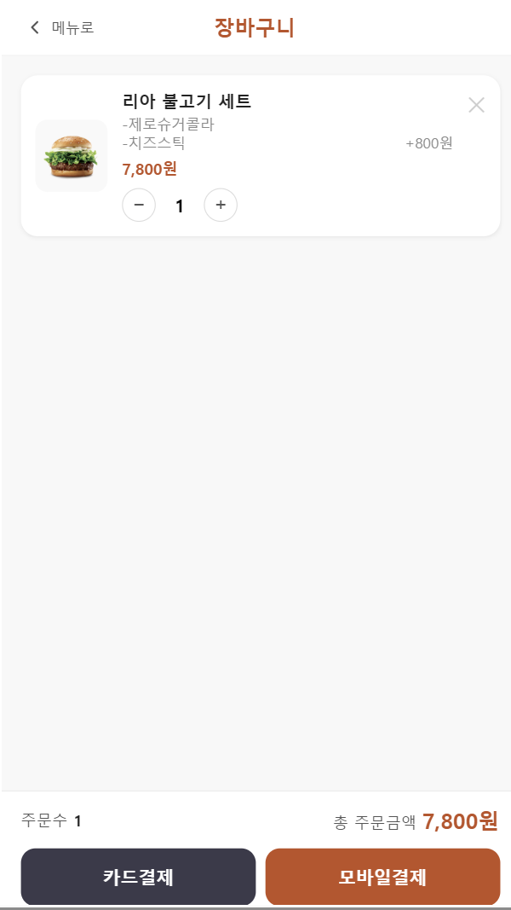
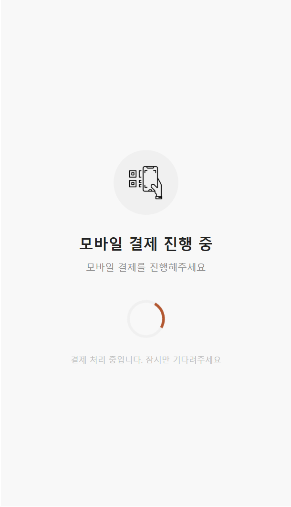
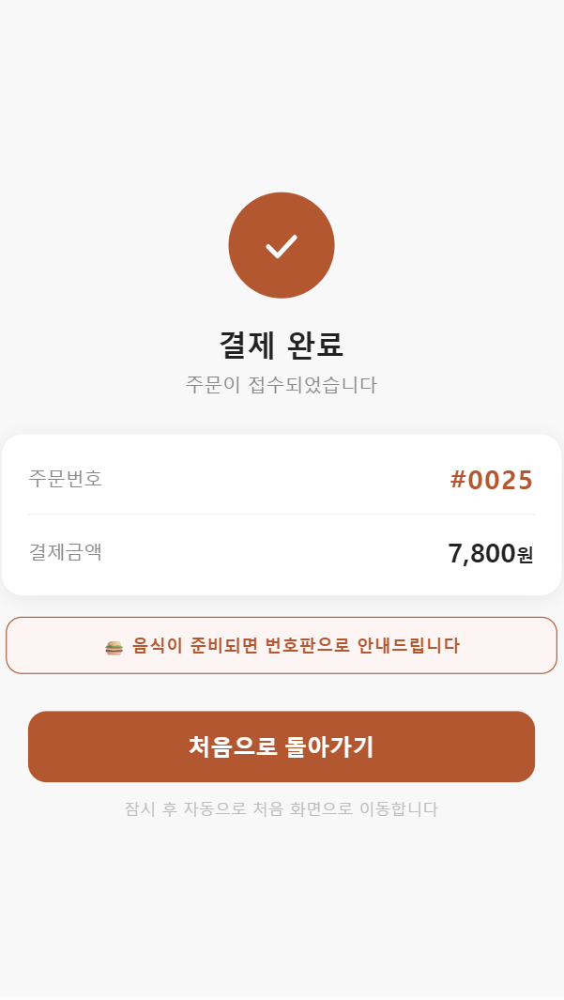

# 사용자 의도 파악 및 맥락기반 추천 기능을 갖춘 지능형 음성 결제 에이전트 — 프론트엔드

기존 키오스크의 복잡한 계층형 UI 없이, 사용자의 자연스러운 음성 발화만으로 메뉴 탐색부터 결제 완료까지의 전체 주문 흐름을 처리하는 키오스크 프론트엔드입니다.
백엔드 AI 에이전트의 응답(TTS 음성 + 화면 액션)을 실시간 WebSocket으로 수신해 UI에 반영합니다.

> 백엔드 레포: [agentic-kiosk](https://github.com/culyrh/agentic-kiosk.git)

## 주요 기능

- 음성 인식 기반 자연어 메뉴 주문
- 실시간 AI 응답 표시 및 TTS 재생
- 음성 추천 메뉴 카드 표시
- 세션 기반 장바구니 관리
- 터치/음성 복합 인터랙션 지원
- 키오스크 화면 크기 자동 스케일링

---

## 환경 세팅

**Node.js 20+ 권장**

### 패키지 설치

```bash
npm install
```

### 환경변수 설정

`.env` 파일 생성 후 백엔드 서버 주소 입력:

```bash
cp .env.example .env
```

| 변수                | 설명                 | 기본값                  |
| ------------------- | -------------------- | ----------------------- |
| `VITE_API_BASE_URL` | 백엔드 REST API 주소 | `http://localhost:8000` |
| `VITE_WS_BASE_URL`  | WebSocket 서버 주소  | `ws://localhost:8000`   |

> **브라우저 마이크 접근(`getUserMedia`)은 HTTPS 또는 localhost 환경에서만 동작합니다.**
> EC2 등 외부 서버에 배포할 경우 반드시 HTTPS를 적용해야 합니다.

### 개발 서버 실행

```bash
npm run dev
```

브라우저에서 `http://localhost:5173` 접속

### 프로덕션 빌드 및 실행

```bash
npm run build
npx serve dist
```

`http://localhost:3000` 접속

---

## 화면 흐름

<table>
  <tr>
    <td align="center"><b>① 시작</b><br/></td>
    <td align="center"><b>② 메뉴 목록</b><br/></td>
    <td align="center"><b>③ 음성 추천</b><br/></td>
    <td align="center"><b>④ 세트/단품 선택</b><br/></td>
    <td align="center"><b>⑤ 음료 선택</b><br/></td>
  </tr>
  <tr>
    <td align="center"><b>⑥ 사이드 선택</b><br/></td>
    <td align="center"><b>⑦ 장바구니 담기</b><br/></td>
    <td align="center"><b>⑧ 장바구니 확인</b><br/></td>
    <td align="center"><b>⑨ 결제 대기</b><br/></td>
    <td align="center"><b>⑩ 결제 완료</b><br/></td>
  </tr>
</table>

> 결제 완료 후 15초 뒤 자동으로 시작 화면으로 복귀합니다.

---

## 뷰포트 스케일링

키오스크 화면 크기에 관계없이 일정한 레이아웃을 유지하기 위해 **디자인 기준폭 430px** 기반의 자동 스케일링을 적용합니다.

- `App.tsx`의 `KioskScaler` 컴포넌트가 화면 너비에 맞는 `scale` 값을 계산해 전체 UI에 적용
- 코드 내 모든 px 수치는 430px 기준으로 작성되어 있으며, 실제 화면에서는 비율에 맞게 확대됩니다

---

## 기술 스택

| 역할            | 기술                      |
| --------------- | ------------------------- |
| 프레임워크      | React 18 + Vite           |
| 언어            | TypeScript                |
| 서버 상태 관리  | TanStack React Query      |
| HTTP 클라이언트 | Axios                     |
| 라우팅          | React Router v6           |
| 음성 처리       | Web Audio API + WebSocket |

---

## 시스템 동작 구조

```
브라우저 마이크
↓
float32 PCM (4096 샘플 청크, 16kHz mono 리샘플링)
↓
WS /stt/ws?session_id={id}
↓
백엔드 파이프라인 (STT → LLM 정제 → AI 에이전트 → TTS)
↓
수신 (발화 끝날 때마다 2개 frame 순서대로)
↓
┌─────────────────────────────────────────┐
│                                         │
│  text frame (JSON)   binary frame (MP3) │
│  ┌───────────────┐   ┌───────────────┐  │
│  │ stt_text      │   │ voice 텍스트를 │  │
│  │ refined_text  │   │ TTS 변환한     │  │
│  │ voice         │   │ 오디오 재생    │  │
│  │ screen        │   └───────────────┘  │
│  │ action        │                      │
│  └───────────────┘                      │
│  → AI 대사 화면 표시                     │
│  → action에 따라 페이지 이동 / 모달 제어 │
│  → screen 있으면 추천 메뉴 카드 표시     │
└─────────────────────────────────────────┘
```

### action 값 정의

| action 값             | 동작                            |
| --------------------- | ------------------------------- |
| `PAGE:cart`           | 장바구니 페이지로 이동          |
| `PAGE:welcome`        | 시작 화면으로 이동              |
| `PAGE:menu`           | 메뉴 화면으로 이동              |
| `PAGE:complete`       | 결제 완료 화면으로 이동         |
| `PAGE:payment_card`   | 카드 결제 대기 화면으로 이동    |
| `PAGE:payment_mobile` | 모바일 결제 대기 화면으로 이동  |
| `TAB:{카테고리}`      | 해당 카테고리 탭으로 전환       |
| `RECOMMEND`           | 추천 메뉴 카드 화면에 표시      |
| `CART_ADD`            | 옵션 모달 확인 단계로 이동      |
| `TYPE_SELECT:{id}`    | 해당 메뉴 세트/단품 모달 열기   |
| `DRINK_SELECT:{id}`   | 해당 메뉴 음료 선택 모달 열기   |
| `SIDE_SELECT:{id}`    | 해당 메뉴 사이드 선택 모달 열기 |
| `TIMEOUT`             | 세션 초기화 후 시작 화면으로    |

---

## 프로젝트 구조

```
src/
├── api/
│   ├── client.ts            # Axios 인스턴스 (baseURL 설정)
│   ├── menu.ts              # 메뉴 목록 / 세트 정보 API
│   ├── cart.ts              # 장바구니 CRUD API
│   └── order.ts             # 주문 생성 / 결제 완료 API
│
├── types/
│   └── index.ts             # 공통 타입 정의
│
├── lib/
│   └── wsManager.ts         # WebSocket 싱글톤 매니저
│
├── hooks/
│   └── useVoice.ts          # WebSocket 연결 + 마이크 스트림 + TTS 재생
│
├── store/
│   ├── voiceStore.tsx       # VoiceProvider (음성 Context 전역 공급)
│   ├── sessionStore.ts      # 세션 ID 전역 상태
│   └── cartStore.ts         # 장바구니 상태 + React Query 연동
│
├── pages/
│   ├── Start.tsx            # 시작 화면 (터치/음성 주문 선택)
│   ├── Home.tsx             # 메뉴 목록 화면 (3x3 그리드, 카테고리 탭)
│   ├── Cart.tsx             # 장바구니 화면 (카드/모바일 결제)
│   ├── PaymentWaiting.tsx   # 결제 대기 화면 (카드/모바일)
│   └── PaymentComplete.tsx  # 결제 완료 화면
│
└── components/
    ├── VoiceWave.tsx        # 음성 파형 애니메이션
    └── OptionModal.tsx      # 메뉴 옵션 모달 (세트/단품 → 음료 → 사이드 → 확인)
```
